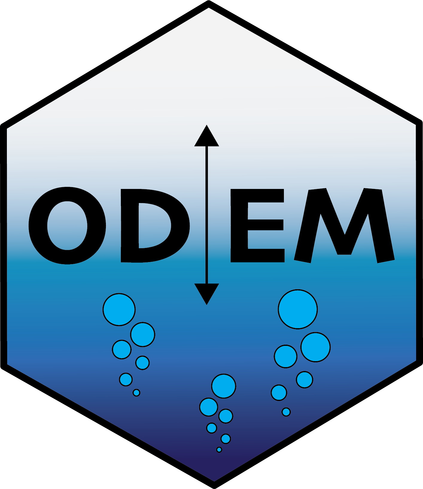

# Parsimonious Model of Lake Hypolimnetic Oxygen Consumption in US Midwestern Lakes

Data processing for classifying regional hypolimnetic DO consumption patterns through a two-layered metabolism model. Clustered patterns are used in a logistic regression analysis to identify main predictors of hypolimnetic DO consumption.

## Data

### Input data

 * temperature: `pball_*_temperatures`

 * meteorology: `NLDAS_*`

 * water quality data from LTER: `wq_data_*`

 * nml file : `nhdhr_*.nml`

### Output data

|variable                 |
|:-----------------|
|datetime          |
|thermocline_depth |
|temperature_epi   |
|temperature_hypo  |
|temperature_total |
|volume_total      |
|volume_epi        |
|volume_hypo       |
|area_thermocline  |
|area_surface      |
|upper_meta        |
|lower_meta        |
|year              |
|day_of_year       |
|max.d             |
|wind              |
|airtemp           |

-----

This R-package is still under development and functions are likely to change with future updates. `odem.data` is maintained by UW-Madison Center for Limnology. All data were obtained from online repositories, e.g. NTL-LTER and the USGS Water Quality Portal. This project is part of the Data Science Initiative at UW-Madison.
