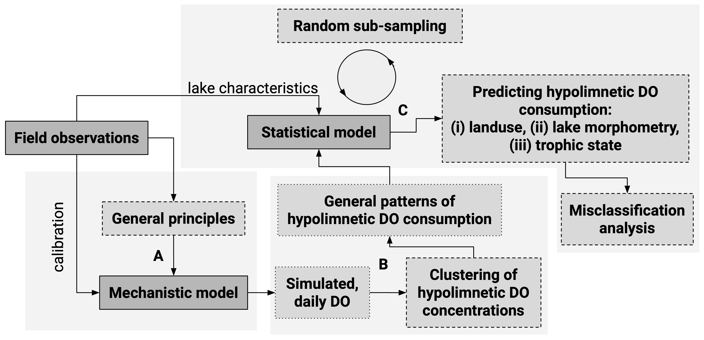

# Parsimonious Model of Lake Hypolimnetic Oxygen Consumption in US Midwestern Lakes

Data processing for classifying regional hypolimnetic DO consumption patterns through a two-layered metabolism model. Clustered patterns are used in a logistic regression analysis to identify main predictors of hypolimnetic DO consumption.

-----

This R-package is still under development and functions are likely to change with future updates. `odem.data` is maintained by UW-Madison Center for Limnology. All data were obtained from online repositories, e.g. NTL-LTER and the USGS Water Quality Portal. This project is part of the Data Science Initiative at UW-Madison.
